# UoM COMP90054 Contest Project - anonymousTeam

# 1. YouTube Demo Video

Our Youtube presentation video link is:

<https://youtu.be/nUB0plAoz2c>

## 1.1 Team Members:
 * Long Junyu - 871689 - j.long12@student.unimelb.edu.au
 * Wu Jiashu - 1008033 - jiashu@student.unimelb.edu.au
 * Zhang Shiyao - 979308 - shiyao.zhang1@student.unimelb.edu.au

# 2. Project Challenges Overview
In this project, we faced the following challenges:
1. The implementation should be computationally efficient, as for each step we only have one second to do all computations, and before the competition starts we only have 15 seconds for pre-computation. 
2. The agent should be generalizable, as it should be capable to compete with different opponents on random maze layouts. 

Given these challenges we faced, we chose the following techniques and made the following design decisions. 

# 3. Techniques
Techniques we used during this project are: 

  * Heuristic Search
  * Deep Q-learning Network (DQN)

The technique we submitted for the final contest is the Heuristic Search agent, as it is stronger and more powerful than our Deep Q-learning agent. 

## 3.1 Approaches

The reason why we decided to experiment with Heuristic Search for our agent is that heuristic search algorithm enjoys the following advantages:
1. No training process required
2. Computationally efficient
3. Very effective for finding the optimal path to reach the goal
4. Easy to implement
5. It’s generalizable

The reason why we decided to experiment with Deep Q-learning for our agent is that:

1. One of the most state-of-the-art solution for many AI Applications.
2. Limited domain knowledge involved in development. 


# 4. Design Decisions Explanation

## 4.1 Heuristic Search

### 4.1.1 Heuristic Search Invader Agent

#### Definition: Safe coordinate and Risky coordinate

Firstly, we defined the concept of “safe” coordinate. A coordinate is safe if there are at least two neighbour points which are not wall, and for each of them, there exists at least one path to reach home territory which doesn’t pass through the current coordinate. 

Coordinates that are not safe is considered as risky. 

The screenshot below illustrates examples of safe coordinates and risky coordinates

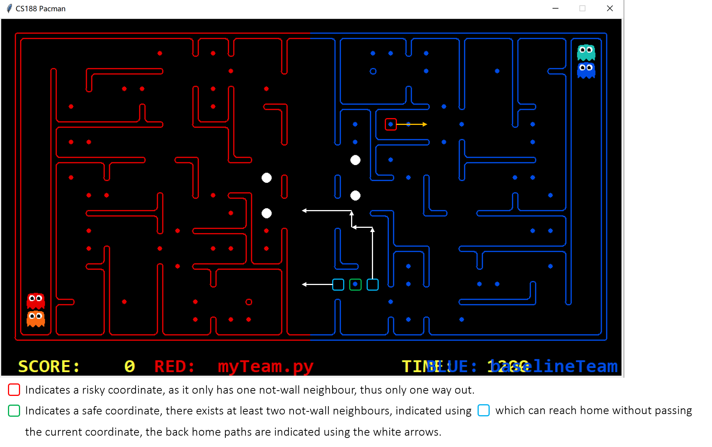

#### Design Decisions

For heuristic search invader agent, under different circumstances, different goals and Manhattan heuristic will be used. By saying circumstances, it refers to both the current position of the invader itself, and the surrounding environment, i.e. whether foods, capsules, opponent ghosts and opponent pacmans present or not. Note that the Manhattan heuristic was used instead of Maze heuristic to avoid timeout issues. The goal selection process and heuristic search under each scenario is as follows:

##### Scenario 1: Invader home mode

* When at home territory → **`invader home mode`**

*`Goal Selection`*
```
If opponent pacman within detectable range && I am not scared && my team’s score is at least 7 points higher than opponent team:
	add opponent pacman into goal list
If goal list is still empty:
	If there is no opponent ghost within detectable range:
		Add all foods into goal list
		Add all capsules into goal list
	Else if there is opponent ghost within detectable range:
		Add all capsule into goal list
		If goal list is still empty: add all safe food into goal list
		If goal list is still empty: add all food into goal list
Goal = closest candidate in goal list
```

*`Heuristic Search`*
```
Heuristic = Manhattan heuristic
Using A* algorithm to search for the optimal path to the goal
```

##### Scenario 2A: Invader hunting mode, safe

* When at opponent territory and no opponent ghost within detectable range → **`invader hunting mode`**

*`Goal Selection`*
```
Add all foods and capsules whose distance to my current position is less than a certain threshold into goal list
Goal = closest candidate in goal list
```

*`Heuristic Search`*
```
Heuristic = Manhattan heuristic
Using A* algorithm to search for the optimal path to the goal
```

##### Scenario 2B: Invader hunting mode, risky

* When at opponent territory and there is ghost within detectable range and at least one of them are not scared (i.e scared time less than a certain threshold) → **`invader hunting mode`**

*`Goal Selection`*
```
Add all capsules whose distance to my current position is less than a certain threshold into goal list
If goal list is still empty:
	If number of food I am currently carrying is greater than a certain threshold:
		Trigger invader retreat mode
	Else add all safe foods into goal list
	If goal list still empty:
		Trigger invader retreat mode
	Else:
		Goal = closest candidate in goal list
```

*`Heuristic Search`*
```
		Heuristic = Manhattan heuristic
		Using A* algorithm to search for the optimal path to the goal
```


##### Scenario 3: Invader power mode

* When at opponent territory and all detectable ghosts are scared → **`invader power mode`**

*`Goal Selection`*
```
Add all foods and all capsules into goal list
If opponent ghost within certain distance threshold to my current position, add it into goal list
Goal = closest candidate in goal list
```

*`Heuristic Search`*
```
Heuristic = Manhattan heuristic
Using A* algorithm to search for the optimal path to the goal
```


##### Scenario 4: Invader retreat mode

* When invader retreat mode is triggered → **`invader retreat mode`**

*`Goal Selection`*
```
Goal = closest home border point
```

*`Heuristic Search`*
```
Heuristic = Manhattan heuristic
Using A* algorithm to search for the optimal path to the goal
```

#### Challenges faced

##### "Deadlock" problem

Among the experiments we performed, one of the challenges faced by the invader agent is the “Deadlock” problem, i.e. the invader attempts to reach a goal, however the path is blocked by opponent ghost, if that happens, the invader will go back and forth at the same place without making any progress. 

##### Risky foods

Some of the risky foods, for instance, those foods located in a very deep no-thru-road, are very hard to be eaten by invader itself. There need to be a strong cooperation between two agents. 

#### Possible future improvements

We can experiment using Monte Carlo Tree Search to select goals for heuristic search algorithm, hopefully this can tackle the issue of deadlock problem. 

We also consider establishing stronger cooperation between our two agents, for example, one agent eat these risky foods, while another agent attracts away the opponent's attention. 

### 4.1.2 Heuristic Search Defender Agent

The action chosen by Astar defender depends on which mode the agent is currently in and the mode is mainly determined by two factors, i.e., the state of opponents and the state of itself.

#### Modes and problems
The modes we defined are:
*  *`Hunt mode`*: chasing the invader
*  *`Search Invader mode`*: search for the last eaten food
*  *`Normal Defend mode`*: going to the middle point of boundary line and waiting
*  *`Suicide mode`*: chasing the invader to make itself be eaten ASAP
*  *`Flee mode`*: chasing the invader but keeping the distance to the invader at 2

Also, different kinds of search problems are defined for these modes, which are all derived from the position search problem.

*  <ul>PositionSearchProblem
    <li>Finding paths to a particular point on the pacman board</li>
    <li>Used in:
        <ul>
            <li>Hunt mode</li>
            <li>Search Invader mode</li>
            <li>Normal Defend mode</li>
            <li>Suicide mode</li>
        </ul>
    </li>
</ul>

*  <ul>AvoidProblem
    <li>Finding paths to a particular point on the pacman board when considering the opponent and the positions which are next to the positions and not in our territory as walls.</li>
    <li>Used in the following modes <em>when an opponent ghost can be detected</em>.
        <ul>
            <li>Hunt mode</li>
            <li>Search Invader mode</li>
            <li>Normal Defend mode</li>
        </ul>
    </li>
</ul>

*  <ul>FleeProblem
    <li>Finding paths to a particular point on the pacman board when considering the opponent and the positions next to it as walls and the positions which are 2 steps away from the opponent pacman as goals.</li>
    <li>Used in Flee mode</li>
</ul>

We use if else to decide which mode the agent is in, and the mode decides what parameters should be passed into which problem. After that, the problem is passed into A star Search algorithm. 
In brief:
```
As a normal defender, which means not being scared:
    If any enemy invader can be observed -> Hunt mode
    Else:
        If the number of the protected food decreases -> Search Invader mode
        Else -> Normal defend mode

As a scared defender:
    If any enemy invader can be observed:
        If the maze distance( initial position, current position) < scared time left 
        -> Suicide mode
        Else -> Flee mode
    Else -> perform as a normal defender
```

After watching several replays of contests, we decided to implement some improvements on the defender: to make it more aggressive by adding steal food mode, and to make it more flexible by adding track mode. 

*  *`Steal food mode`*: Activated when the defender has just eaten the enemy invader and there are no other invaders. The reason is that it always takes an agent some time to come out from its initial position. Therefore, the defender should make use of this period of time to perform as an invader to get more points. Once it is detected that someone invading its territory, the defender will go home and defend food.
*  *`Track mode`*: Activated when the defender can observe a potential enemy invader, that is, an enemy who has invaded before. Then the defender follows the potential invader but does not cross the boundary.

The improved mode-choosing process:
```
As a normal defender, which means not being scared:
    If any enemy invader can be observed -> Hunt mode
    Else:
        If the number of the protected food decreases -> Search Invader mode
        Else -> Normal Defend mode

As a scared defender:
    If any enemy invader can be observed:
        If the maze distance( initial position, current position) < scared time left 
        -> Suicide mode
        Else -> Flee mode
    Else: 
        If any potential invader can be observed -> Track mode
        If the defender has just eaten an enemy -> Steal Food mode
        Else -> Normal Defend mode
```

#### Challenges faced:
*  Defend food from 2 invaders. After watching the records of tournaments, we found that a few teams adopt the strategy of two aggressive invaders and no defenders at all. In this case, it is hard for the defender agent to protect food effectively, especially when one of the enemy invaders aims at the capsule first.
*  The tradeoff between eating food to earn points and protecting food from enemies when being a scared ghost. Should the scared defender track the invader at a distance of 2, or should it totally give up defending and eating food aggressively? It’s quite difficult to find a perfect and general strategy.

#### Possible future improvements:
*  The strategy chosen can be determined by the behaviour patent of opponents. For example, we should pay more attention to defending when the opponent teams have two aggressive invaders.


## 4.2 DQN 

We also developed a learning-based agent, which is powered by a deep neural network.

### 4.2.1 Network Architecture
The network has two parts: convolutional base net and the following fully connected Q-net. The Convolutional base net is designed to make sense of our state representation, and the latter is used to predict Q-values of each action.
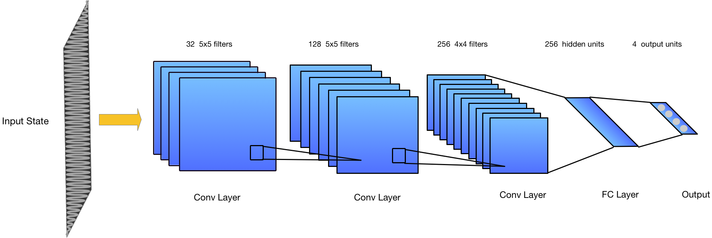
The network architecture is as shown above. There are 3 convolutional layers followed by 1 fully connected layer with *`ReLU`* activation. Pooling is not used because input state does not have a high 'resolution'.

### 4.2.2 State Representation:
The game state model should provide ‘useful’ information for an agent to make a move. Thus, it should reflect the some aspects of the game environment as well as exiting agents according to the game rules. In our design, we want to track the states of foods, capsules, my position, ghosts, scared ghosts, Pacmans and the maze. For example: 
  * Maze matrix: 
    > *`MazeMatrix: `* 0 for wall points, 1 for valid path (reachable) points. Encoded as if it is a greyscale picture $`\{ \ 0 \rightarrow 0, \ 1 \rightarrow 255 \ \}`$

```math
\begin{bmatrix} 
0 & 0 & 0 & 0 & 0\\
0 & 1 & 1 & 1 & 0\\
0 & 1 & 0& 0 & 0\\
0 & 1 & 1 & 1 & 0\\
0 & 0 & 0 & 0 & 0
\end{bmatrix}
```
  * MyPosition matrix: 
     > *`MyPositionMatrix: `* 0 for my current position. Encoded as if it is a greyscale picture $`\{ \ 0 \rightarrow 0, \ 1 \rightarrow255 \ \}`$

```math
\begin{bmatrix} 
nan & nan & nan & nan & nan\\
nan & nan & nan & nan & nan\\
nan & nan & 0 & nan & nan\\
nan & nan & nan & nan & nan\\
nan & nan & nan & nan & nan
\end{bmatrix}
```
   * Food matrix, Capsule matrix, Ghost matrix, Scared ghost matrix, Pacman matrix: 
      > *`FoodMatrix: `* 0 for food to protect, 1 for target food. Encoding: $`\{ \ 0 \rightarrow 20, \ 1 \rightarrow 30 \ \}`$ \
      > *`CapsuleMatrix: `* 0 for capsule to protect, 1 for target capsule. Encoding:  $`\{\ 0 \rightarrow 25, \ 1 \rightarrow 35 \ \} `$ \
      > *`GhostMatrix: `* 0 for ghost of my team, 1 for ghosts of opponent. Encoding:  $` \{\ 0 \rightarrow 40, \ 1 \rightarrow 50 \ \}`$ \
      > *`ScaredGhostMatrix: `* 0 for scared ghost of my team, 1 for scared ghosts of opponent. Encoding: $`\{\ 0 \rightarrow 45, \ 1 \rightarrow 55 \ \} `$ \
      > *`PacmanMatrix: `* 0 for Pacman of my team, 1 for Pacman of opponent. Encoding: $`\{\ 0 \rightarrow 60, \ 1 \rightarrow 70 \ \} `$ 

```math
\begin{bmatrix} 
nan & nan & nan & nan & nan\\
nan & 0 & nan & 1 & nan\\
nan & nan & nan & nan & nan\\
nan & 0 & nan & 1 & nan\\
nan & nan & nan& nan & nan
\end{bmatrix}
```

> ***`Note`*** All Matrix values are finally normalized to be in *`range [0, 1]`* by dividing 255

### 4.2.3 Experience Replay
In order to improve the learning progress, experience replay are used to store the moves (actions) of an agent together with other info like game states and rewards as a single replay experience. And the experience will be randomly sampled into batches of specified size to train the network.
Typically, the replay memory will store moves independently. However, in this project, we define a class named **`NStepProgress`**, which packs N continuous moves as a step, and generate experiences and push them to the experience replay buffer. The reason why choosing to pack a number of continuous moves as a step is that we hope the agent learns from a given number of moves, which make up a history, instead of learning from the feedback of one single step move.
The rewards of steps are accumulated from the very last one to the first, applying a decay factor. Going back to the Q-value updating formula derived from *`Bellman Equation`*:
```math
Q(S_t, A_t) \leftarrow Q(S_t, A_t) + \alpha [ R_{t+1} + \gamma \max_{a} Q(S_{t+1}, a)-Q(S_t, A_t) ]
```

The $`Q_{target}`$ part is $`R_{t+1} + \gamma \max_{a} Q(S_{t+1}, a)`$, and the related function of calculation is: 
```python
    def eligibility_trace(self, batch):
        gamma = 0.9  # reward decay
        inputs = []
        targets = []
        for series in batch:  # series --> one history containing n steps
            input = np.array([series[0].state, series[-1].state], dtype=np.float32)
            output = self.controller.brain.forward(input)  # Q-value prediction
            cumulated_reward = 0.0 if series[-1].isDone else np.max(output[1])  # Max Q prediction
            for step in reversed(series[:-1]):
                cumulated_reward = step.reward + gamma * cumulated_reward
            state = series[0].state
            target = output[0].data
            target[series[0].action] = cumulated_reward
            inputs.append(state)  # batch input volumes
            targets.append(target)  # batch Q-Targets
        return np.array(inputs, dtype=np.float32), np.array(targets, dtype=np.float32)
```
The loss function here is *`mean squared error (MSE)`* of $`Q_{prediction}`$ and $`Q_{target}`$. The network is going to update its gradients using back propagation.

### 4.2.4 Reflection
* Challenges
    1. Game length Limitation. 
        > Agent won’t learn much if the game ends before it is able to explore the whole maze. For instance, the opponent agents lead the game and end the game so quickly, which the agent with   zero knowledge does not even able to go across the maze boards and eat food or capsules. This is addressed by tripling (or quadrupling) the game length limit and also make the opponent an idle agent or zero-knowledge DQN agents too.

    2.  Cost of training from scratch is extremely high.
        > Training starts with zero-knowledge requires a large amount of game episodes to get helpful experiences. Besides, the increasing in the game length limit also adds to the training cost. If trained with CPU, 10000 game episodes are estimated to take a number of weeks. (We don't have GPUs, thus we only implement the CPU version)

    3.  Hard to generalize to all kinds of mazes
        * Different layouts with same shape
        > The training is on RANDOM layouts, and they are all of shape (34, 18). However, it is still hard to tell whether it can generalize well on different layouts of the same shape since the performances on various layouts are all less-than-desirable due to the extremely high training loss. That is, the DQN agents are still just-beyond-scratch.
        * Different layouts with different shapes
        > It is hard to find a decent reshaping strategy in this Pacman contest scenario,  although some resizing techniques, which are widely used in convolutional networks (Image processing), might be helpful.  e.g, scaling, padding and pixel interpolation

    4.  Reward policy design
        * Hard to design a just-good reward plan
        > A good reward design should be able to reflect the game rules properly. We defined some entries (features) to serve as the reward breakdowns of an action made. A poorly-designed reward plan may be less helpful to make the agent to learn a good policy. Also, it makes the training hard to converge. 
        * Hard to balance the quantified reward values properly.
        > In fact, during our training processes, we observed some cases that the agents discovered some vulnerabilities of a previous reward design. The agent some times choose actions that attracts less penalty (negative rewards) and choose to stop for a number of turns at some point. Especially when we try to define different roles: `Defender & Invader`.
        > \
        > We combined these roles as a MixedDQN agent. Here's the our final version of the reward plan, with lots of penalties entries removed:
        >    > Eat a food dot:  20 \
        >    > Eat a capsule: 25 \
        >    > Kill a scared ghost: -2 \
        >    > Win a game: 100 \
        >    > Killed by a ghost: -50 \
        >    > Kill an opponents: 20 \
        >    > Lose a game: -100 \
        >    > Stay alive bonus: 1 or 5 when it is a Pacman \
        >    > Legal Action: 1 or -1 if illegal

* Possible improvement \
Research on advanced DQN variants. i.e, Double DQN


# 5. Experimental Analysis

## 5.1 Comparison between heuristic search agent and DQN agent

Firstly, we performed heuristic search agent vs baseline and DQN agent vs baseline, to see which agent is more powerful, and thus decide which version to be used for final contest. Tables below summarise the experimental outcome of heuristic search agent vs baseline agent. 

### Red: myTeam vs Blue: baselineTeam

| Seed | # food eaten | # eaten by opponent | # deadlock | # safe escape back home | # opponent eaten | Contest result
|:-------------:|:-------------:|:-------------:|:-------------:|:-------------:|:-------------:|:-------------:|
| 7247 | 22 | 0 | 0 | 6 | 9 | Win |
| 3190 | 28 | 0 | 0 | 3 | 5 | Win |
| 4839 | 22 | 0 | 0 | 4 | 4 | Win |
| 3252 | 14 | 1 | 0 | 3 | 5 | Win |
| 1948 | 24 | 0 | 0 | 6 | 4 | Win |

### Red: baselineTeam vs Blue: myTeam

| Seed | # food eaten | # eaten by opponent | # deadlock | # safe escape back home | # opponent eaten | Contest result
|:-------------:|:-------------:|:-------------:|:-------------:|:-------------:|:-------------:|:-------------:|
| 2100 | 26 | 0 | 0 | 5 | 7 | Win |
| 6706 | 27 | 1 | 0 | 4 | 8 | Win |
| 8210 | 9 | 0 | 1 | 2 | 3 | Win | 
| 1412 | 28 | 0 | 0 | 3 | 4 | Win |
| 1216 | 20 | 0 | 0 | 6 | 9 | Win |

From the experimental outcomes above, we can see that the Heuristic Search Agent achieved 100% of winning, an average of 22 foods had been eaten, which demonstrates a strong capability of invading, and on average, opponent ghosts were eaten 5.8 times per game, which indicates strong defending ability. 

However, due to the challenges faced by DQN as we described above, the DQN agent performed poorly. The demo below shows the poor performance of the agent, its unsatisfacing performance makes the performance table unnecessary. 

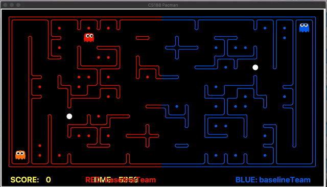

> *Note*: This is a video clip randomly picked from the training replays. The Agent is trained individually against idle agents.  

Therefore, after thorough experiment and analysis, we decided to use our Heuristic Search Agent as our final contest agent. 

## 5.2 Comparison between Heuristic Search Agent and staff super team

| Seed | # score | # eaten by opponent | # deadlock | # safe escape back home | # opponent eaten | Contest result
|:-------------:|:-------------:|:-------------:|:-------------:|:-------------:|:-------------:|:-------------:|
| 3542 | 28 | 1 | 0 | 1 | 1 | Win |
| 1701 | 2 | 0 | 1 | 4 | 3 | Win |
| 3188 | 0 | 0 | 1 | 0 | 4 | Tie |
| 4066 | 0 | 2 | 2 | 0 | 4 | Tie |
| 1094 | -17 | 3 | 1 | 1 | 1 | Lost |
| 9706 | 10 | 2 | 1 | 2 | 3 | Win |
| 4747 | 2 | 2 | 1 | 2 | 2 | Win |
| 2487 | 28 | 2 | 0 | 4 | 2 | Win |
| 1875 | -1 | 0 | 1 | 1 | 2 | Lose |
| 6976 | -22 | 0 | 1 | 0 | 1 | Lose |

Table above demonstrates the latest 10 contest results between our heuristic search agent and the staffSuperTeam at the time we wrote this wiki. Our heuristic search agent achieved 50% of winning and 20% of tie game, which is relatively satisfying. Although deadlock problem sometimes happen, it doesn't always lead to losing the game. 

## 5.3 Tournament Result Summary

| Date | Rank in league | Points | Win | Tie | Lost | Score Balance |
|:----:|:--------------:|:------:|:---:|:---:|:----:|:-------------:|
| 10-16 | 1 | 272 | 89 | 5 | 12 | 799 |
| 10-15 | 5 | 224 | 73 | 5 | 20 | 688 |
| 10-14 | 1 | 245 | 79 | 8 | 7 | 806 |
| 10-13 | 5 | 202 | 60 | 22 | 10 | 431 |
| 10-12 | 2 | 226 | 74 | 4 | 10 | 732 |

In the latest 5 tournament, our heuristic search agent ranked in top 5 all the times, the experimental results demonstrates that our agents is strong and effective compared with other teams' agents. 

16th Oct: Our team #1, staff super #3

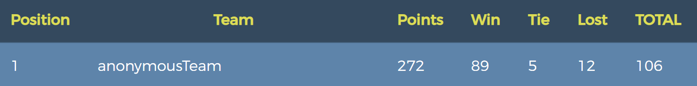

15th Oct: Our team #5, staff super #4

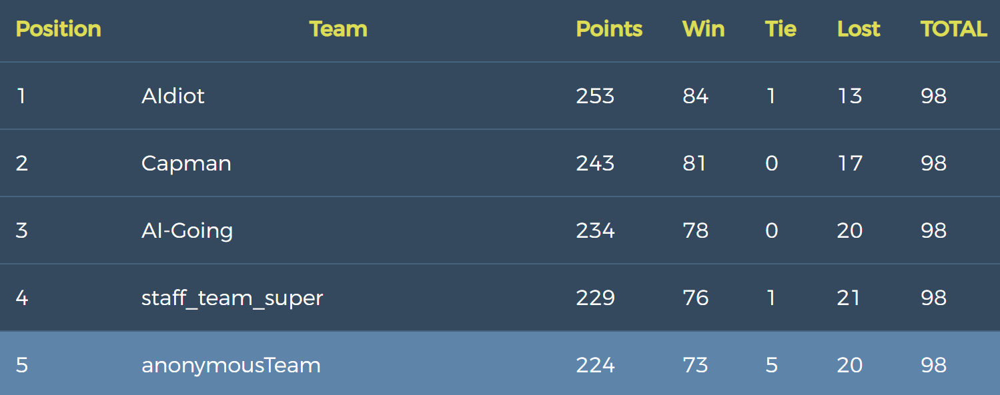

14th Oct: Our team #1, staff super #2

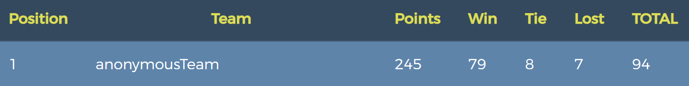

13th Oct: Our team #5, staff super #1

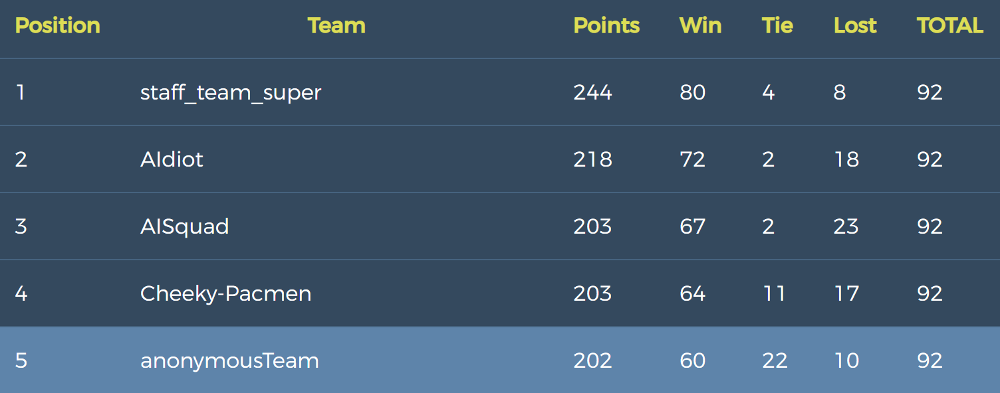

12th Oct: Our team #2, staff super #1

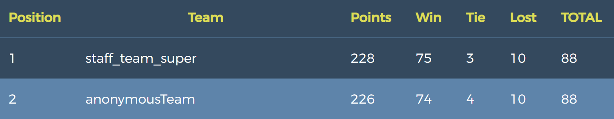

Overall, our team achieved a satisfying outcome in the tournament contests, which demonstrates the effectiveness of our design decision choices and our implementation approaches. 


# 6. Demonstration of performance under different scenario

## 6.1 Heuristic Search Invader Agent

### Invader Power Mode

As we can see from the demo below, under invader power mode, the invader agent can eat both safe and risky foods, when opponent ghost is close enough, it will also hunt the opponent ghost. 

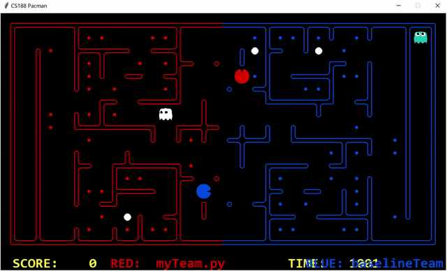

### When being chased, only get safe foods and escape

When the invader is not in power mode and is chased by an opponent ghost, it will not be greedy and will only choose to eat food that is safe, if no nearby safe food exists, it will return home. 

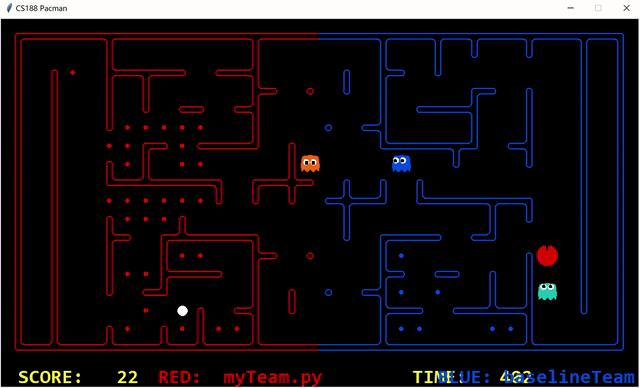

### Invader hunting capsule

When the invader is chasing by an opponent ghost and there is capsule nearby, the invader will give priority to hunt the capsule first. 

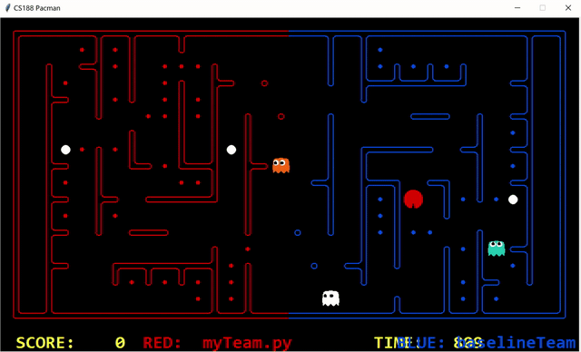

### Invader can also defend

At home territory, when opponent pacman didn't eat the capsule and it is relatively close, the invader agent can also help the defender to defend by eating the opponent pacman. 

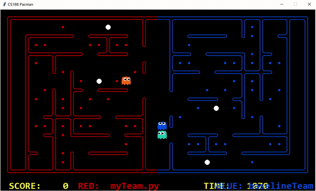

### Won't be too greedy, escape on time

Even at the power mode, the invader still will not be too greedy, it can escape on time when the opponent ghost's scared timer nearly ends. 

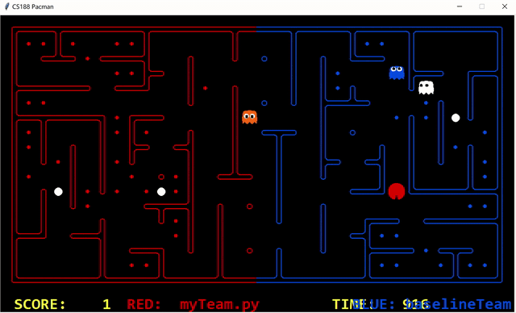

### Won't be too greedy, do not enter the no-thru-road

The food in the no-thru-road is no longer safe if there is ghost nearby. The invader can response quickly when it's not the appropriate time to eat these foods. 

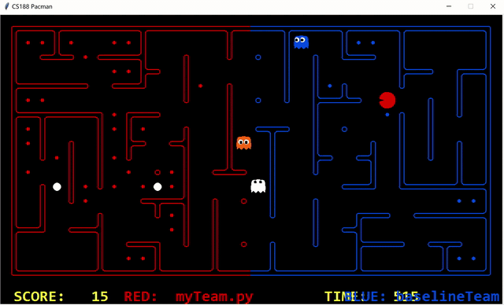

### Invader performs very well at eating safe foods

The invader performs very well at eating safe foods. 

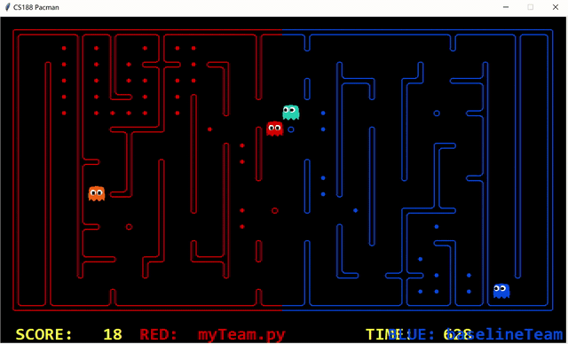

### Escaping works pretty well

When the desired safe food is not reachable, the invader agent will escape on time. 

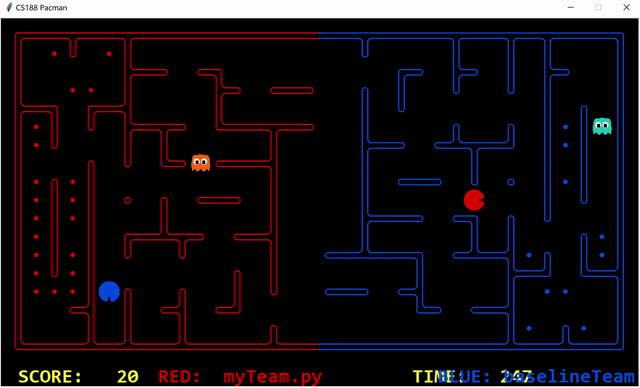

### Challenge: avoid being trapped

Sometimes, the invader will be surrounded by opponent ghosts. 

#### Corresponding future improvements

Possible improvements including trying other techniques like Monte Carlo Tree Search, we can also establish stronger cooperation among agents. 

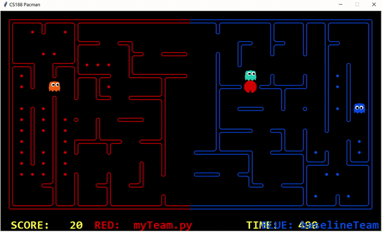

### Challenge: The "deadlock" problem

There need to be a stronger coorperation between invader and defender, otherwise these corner risky foods are unlikely to be eaten, the invader will just move back and forth. 

#### Corresponding future improvements

Establishing better cooperations between team mates is a possible improvement solution, for instance, implementing an emergency helping mode. 

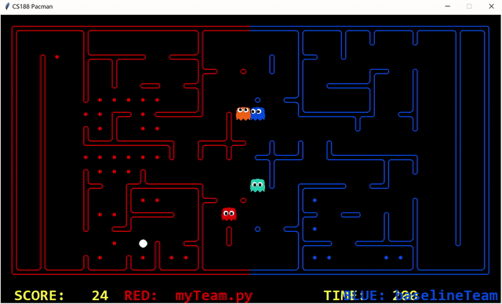

## 6.2 Heuristic Search Defender Agent

### Defend Hunt Mode
Chasing the invader

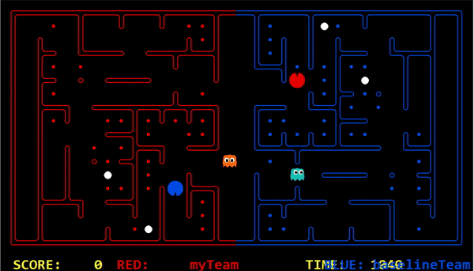

### Search Invader mode
Searching for the last eaten food. Notice the invader is not within 5 squares but the defender can still approach it.
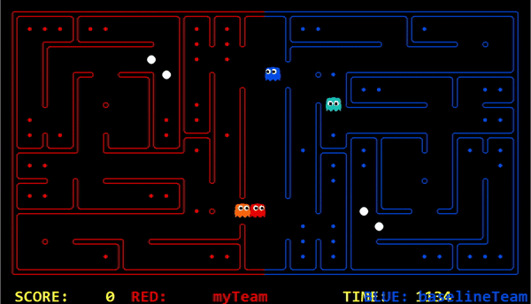

### Track mode
When the defender detects a potential enemy invader, that is, an enemy who has invaded before, it follows that potential invader but does not cross the boundary.\
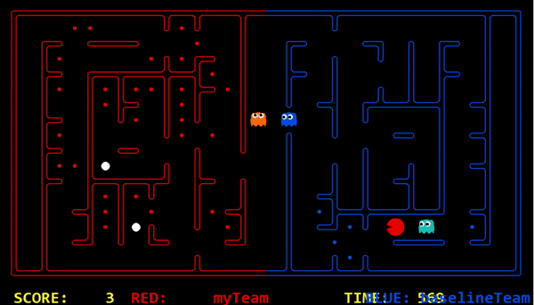

### Suicide mode 
Activated when the maze distance between home and the current position is less than scared time left, the defender chases the invader to suicide so that it can start again as soon as possible.\
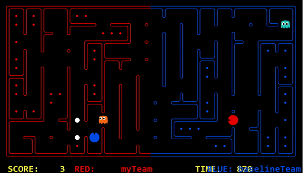

### Steal Food mode
Activated when the defender has just eaten an enemy. The defender invades and eats some relatively near food.\
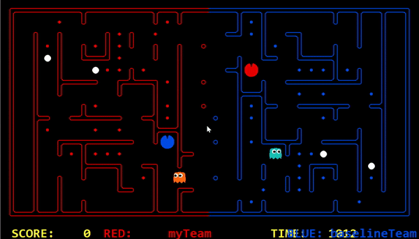


